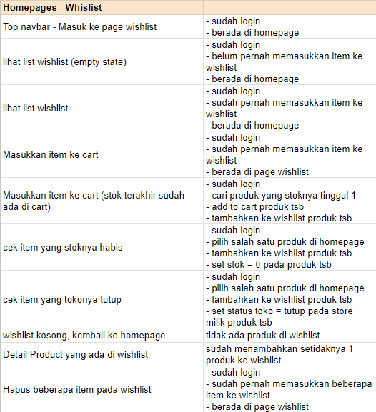
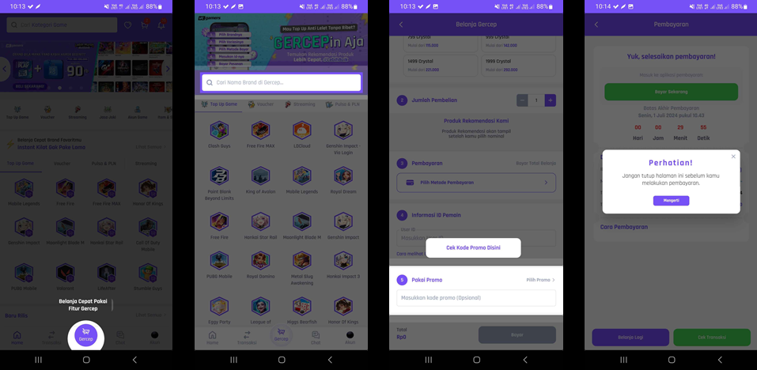

# Additional Work

This section documents additional professional activities that supported my work across customer engagement, marketing, and business operations.

These activities were not limited to a single function and included copywriting, web and application manual QA, and operational support.

---

## Areas of Work

### Copywriting

Supported customer-facing and promotional communication through copywriting activities.

The work included preparing and adapting written communication for customer engagement and promotional purposes.



**Focus:**

- Customer-facing communication
- Promotional messaging
- Campaign communication
- Content adaptation

---

### Web & Application Manual QA

Performed manual quality assurance activities for web and application experiences.

The work involved checking user-facing functionality and identifying issues that could affect the customer experience.



**Focus:**

- Manual functional testing
- User flow checking
- UI / UX observation
- Issue identification
- Customer experience validation

---

### Operational Support

Provided additional operational support across customer, marketing, and business activities.

This included supporting day-to-day activities that required coordination between different functions and helping ensure customer-facing initiatives could be executed as intended.

**Focus:**

- Operational coordination
- Cross-functional support
- Customer-related activities
- Campaign support
- Process execution

---

## Supporting Activities

The additional work documented here demonstrates the broader nature of my previous role.

Rather than being limited to a single specialization, the work required supporting activities across:

```text
Customer
   │
   ├── Communication
   │
   ├── Product / Application Experience
   │
   └── Operational Support
          │
          ↓
   Marketing & Business Operations
