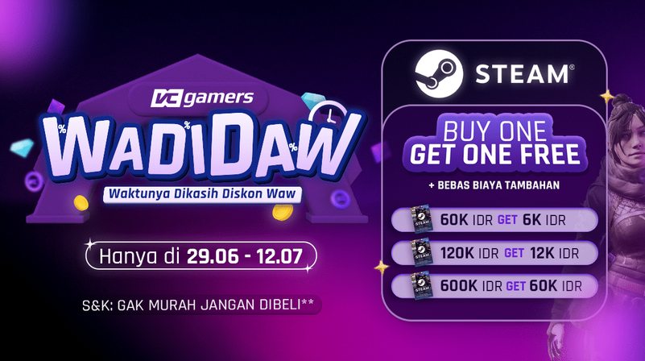
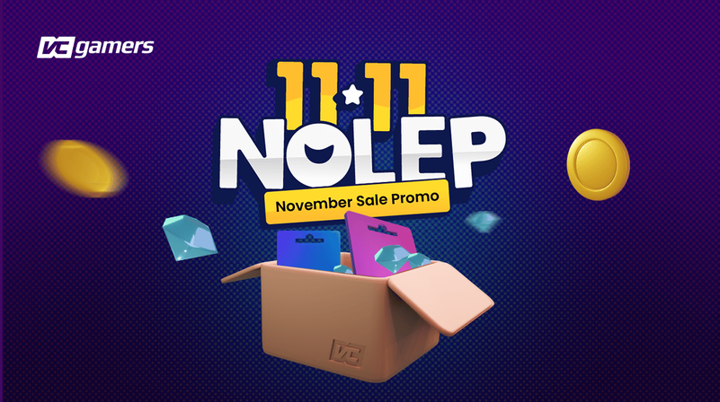
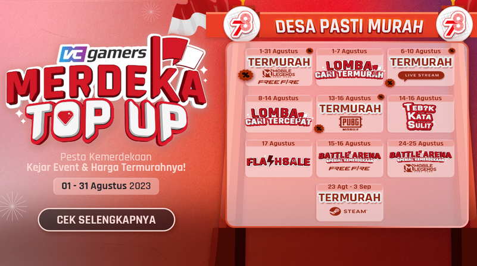
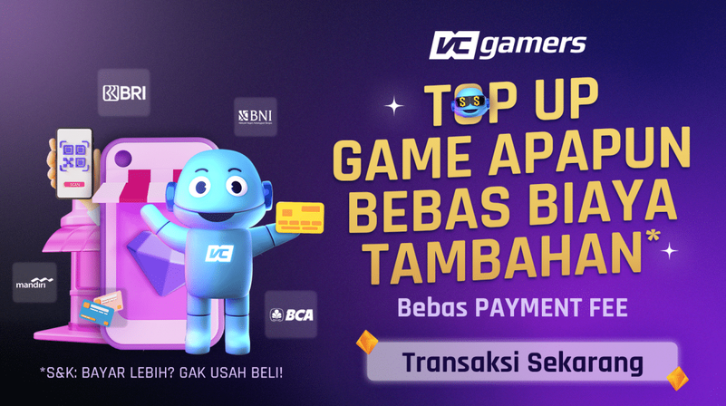
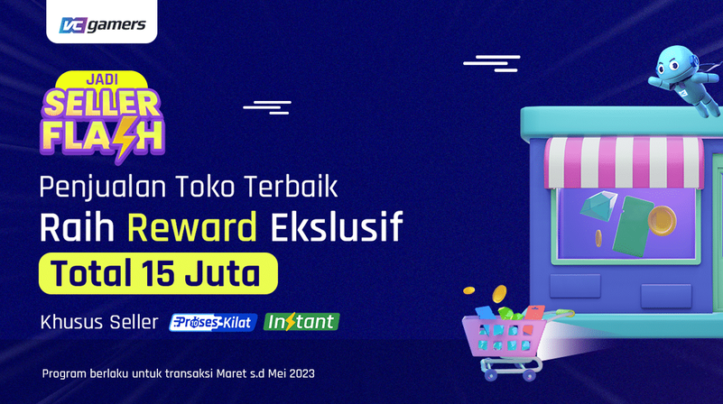
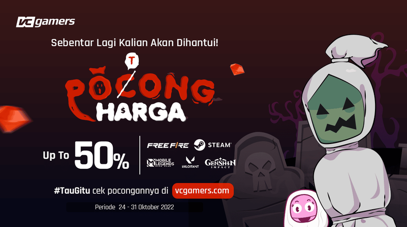
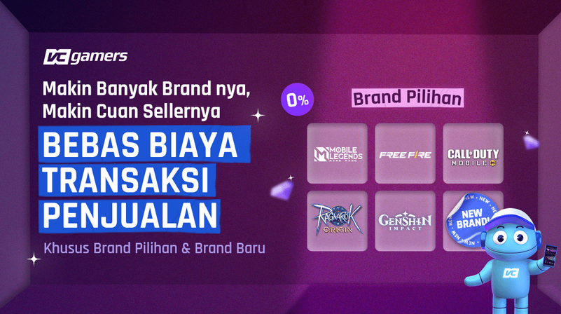

# Campaign Operations

This section documents selected campaign planning and execution work from my previous professional experience.

The work covered sales and promotional campaigns designed to drive transactions, customer engagement, and platform activity.

The available portfolio evidence includes campaign objectives, execution examples, campaign creatives, and documented results.

---

## Overview

My campaign operations work involved:

- Campaign planning
- Campaign execution
- Sales and promotional activities
- Customer engagement
- Campaign communication
- Coordination with marketing and operational activities
- Monitoring campaign performance

The original portfolio describes this work as designing, planning, and executing sales and promotional campaigns to drive sales to the platform. :contentReference[oaicite:0]{index=0}

---

## Selected Campaigns

The campaigns below are selected from the available portfolio documentation and visual evidence.

### 1. Steam WADIDAW Campaign

A promotional campaign focused on Steam-related products and transactions.

The campaign documentation includes promotional creative and a documented result of **10× Gross Transaction Value**.



**Focus:**

- Sales promotion
- Product campaign
- Transaction growth
- Customer communication

**Documented result:**

- 10× Gross Transaction Value

---

### 2. 11.11 Nolep Campaign

A promotional campaign associated with the 11.11 shopping period.

The available portfolio documentation reports a **1,143% ROAS** for the campaign.



**Focus:**

- Promotional campaign
- Sales activation
- Customer acquisition / conversion
- Campaign performance

**Documented result:**

- 1,143% ROAS

---

### 3. Santa's Gift Campaign

A customer engagement and promotional campaign designed to increase activity around the platform.

The portfolio documents **125% social media impressions** and an increase in website visits associated with the campaign.


**Focus:**

- Customer engagement
- Social media campaign
- Promotional communication
- Website traffic

**Documented result:**

- 125% increase in social media impressions
- Increased website visits

---

## Additional Campaign Work

The available campaign materials also include promotional activities covering different products, offers, and sales initiatives.

Examples include:

### Merdeka Game Campaign



### Top Up Gamepass Campaign



### Seller Flash Campaign



### Poong Harga Campaign



### Bebas Biaya Penjualan Campaign



These additional campaign assets are included as supporting evidence of the range of promotional activities documented in the original portfolio.

---

## Campaign Workflow

The campaign work can be broadly described as:

```text
Campaign Objective
        ↓
Campaign Planning
        ↓
Offer / Promotion Design
        ↓
Campaign Communication
        ↓
Campaign Execution
        ↓
Customer / User Engagement
        ↓
Performance Monitoring
