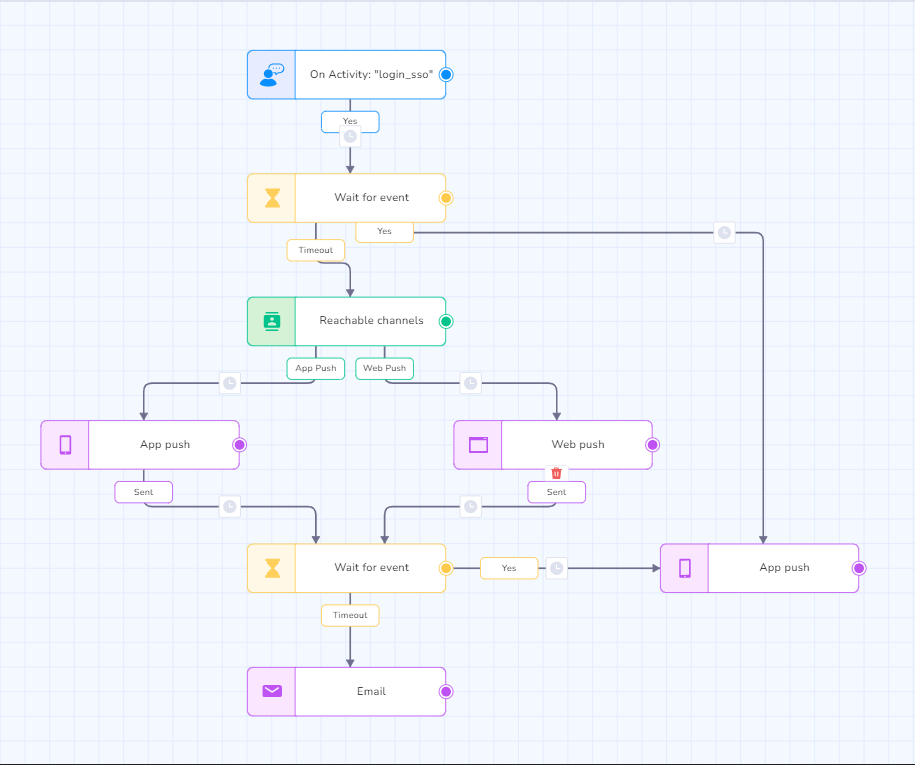
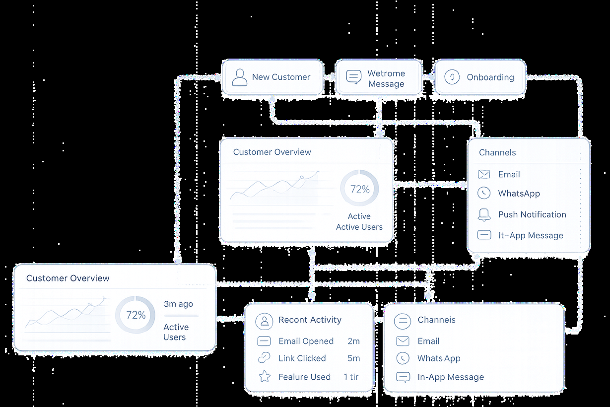
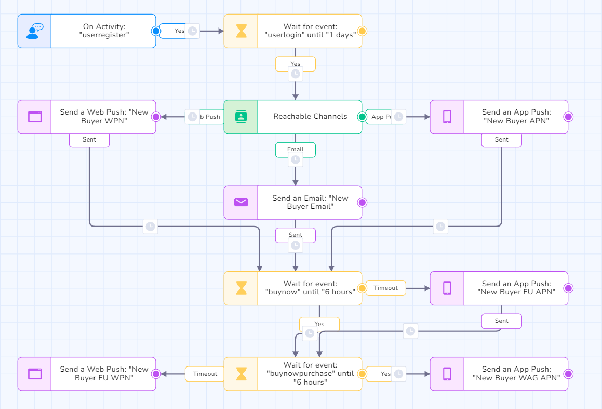
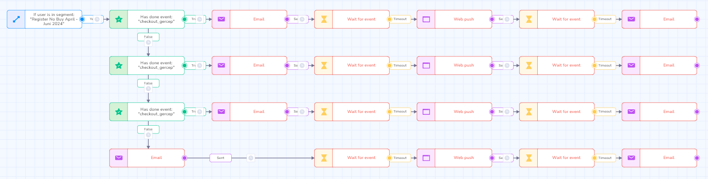

# Customer Engagement

This section documents selected professional work involving customer engagement, user onboarding, activation, transaction journeys, and purchase-related communication.

The work documented here comes from my previous professional experience and is based on the available portfolio evidence from that period.

## Overview

My customer engagement work focused on communicating with users throughout different stages of their customer journey.

This included onboarding newly registered users, encouraging first-time purchases, supporting engagement during transaction flows, and using CRM communication to help move users toward their intended actions.

The available portfolio material shows customer engagement workflows involving multiple communication channels and lifecycle stages.

## Areas of Work

### User Onboarding & Activation

Developed and managed customer communication flows for users entering the platform.

The objective was to guide users from registration toward activation and their first meaningful interaction with the platform.

Activities included:

- User onboarding
- Activation communication
- First-purchase engagement
- Lifecycle communication
- Multi-channel customer communication

### Transaction Journey Engagement

Worked with customer engagement flows around the transaction journey.

Communication was used to engage users at different points of the transaction process and support completion of the intended customer action.

Activities included:

- Transaction journey communication
- Follow-up communication
- User engagement
- Purchase completion support
- Lifecycle automation

### Purchase Journey

Worked with customer communication throughout the purchase journey, from initial engagement through transaction-related activities.

The available portfolio evidence demonstrates how customer communication could be structured around different stages of the user's journey.

## Selected Professional Work

### 1. User Onboarding & Activation

Designed and executed customer engagement workflows for users who had registered on the platform.

The workflow used multiple communication channels to guide users through the early stages of their customer journey.

Documented channels include:

- Email
- Push notifications
- In-app messaging
- Web push



The available portfolio material documents this work as part of user engagement and lifecycle activities.

### 2. Registered User → First Purchase

Worked on customer engagement activities intended to move registered users toward their first purchase.

The documented workflow focused on communication and follow-up during the period between registration and first purchase.

**Focus:**

- User activation
- First-purchase engagement
- Customer lifecycle
- Automated communication

### 3. Transaction Journey Engagement

Developed engagement flows for users who entered the transaction journey.

The workflow used customer communication to follow up with users during the transaction process and support purchase completion.





**Focus:**

- Transaction journey
- Customer engagement
- Follow-up communication
- Purchase completion

### 4. Purchase Journey Engagement

Worked with customer journey communication around purchase-related activities.

The available portfolio material includes documented customer journey examples showing how communication could be structured across different stages of the purchase process.



**Focus:**

- Purchase journey
- Customer lifecycle
- Engagement
- Retention
- Conversion

## Communication Channels

The available portfolio evidence shows customer engagement activities involving multiple communication channels, including:

- Email
- Push notifications
- In-app messaging
- Web push
- WhatsApp-based communication

The specific channels used depended on the workflow and campaign.

## Engagement Workflow

The documented customer engagement work can be broadly represented as:

```text
User Enters Journey
        ↓
Customer Segmentation
        ↓
Relevant Communication
        ↓
User Engagement
        ↓
Customer Action
        ↓
Follow-up / Next Lifecycle Stage
